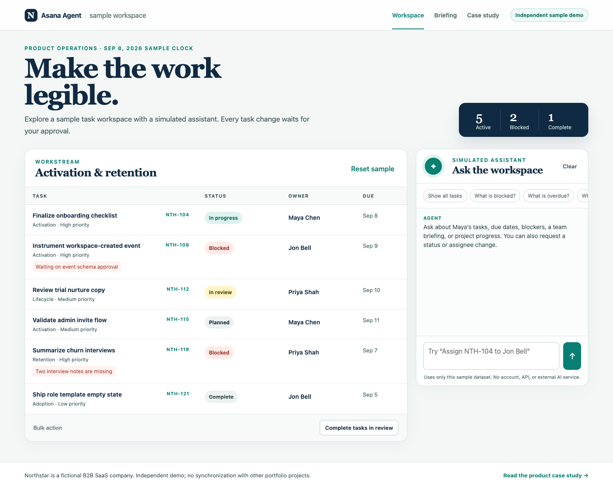

# Asana Agent

**[Try the live demo](https://mvahedi2020.github.io/Asana-Agent/)** · [Watch the workflow](docs/media/workflow.webm) · [Read the case study](docs/product/Case_Study.md)

An independent product sample exploring how a conversational work assistant can answer operational questions and prepare changes without hiding its evidence or impact. The sample workspace belongs to Northstar, a fictional B2B SaaS company. This project is not affiliated with Asana.

## Scenario

A product lead needs to scan assigned work, due dates, blockers, and portfolio progress without assembling a status report by hand. They can ask the assistant in ordinary language, inspect answers against the visible task board, and prepare status or assignee updates. Every write, including a bulk change or reset, pauses at a concrete preview with confirm and cancel controls. The latest confirmed write can be undone.

The assistant is intentionally deterministic. It recalculates answers from the task data currently shown in the browser, handles a narrow set of useful intents, and gives an honest boundary for anything else. No account, API, model call, authentication, or paid service is involved.

## My role

I owned the product problem, user scenario, scope, flows, safety rules, sample data, acceptance criteria, and evaluation plan. Antigravity/AI assisted with implementation. The result is a portfolio prototype for review, not evidence of production performance or autonomous product work.

## Product decisions and tradeoffs

1. **Visible source of truth.** The board and assistant share one local dataset, so every answer can be checked against a task ID. This improves inspectability at the cost of limiting the demo to a small sample workspace.
2. **Confirmation before every write.** Single, bulk, and reset changes all show exact affected records before applying. This adds a step to fast workflows, but makes scope and consequence explicit; clearing chat also leaves a pending preview intact.
3. **Narrow deterministic language support.** The prototype supports task listing, due work, blockers, briefings, summaries, and explicit status or assignee commands. It cannot handle open-ended language like a production model, but it avoids pretending that unsupported work succeeded.

## Limitations

Northstar, its people, dates, tasks, and outcomes are fictional. The project has no Asana integration, live data, user research findings, customer adoption, model evaluation score, or measured business impact. Browser persistence is device-local and may be unavailable; the interface warns when that happens and provides a reset. Production use would require identity, permissions, tenant isolation, audit history, integration reliability, accessibility research, and model safety evaluation.

## Product documentation

- [Case Study](docs/product/Case_Study.md)
- [Product Requirements](docs/product/PRD.md)
- [GTM Strategy](docs/product/GTM_Strategy.md)
- [Sprint Backlog](docs/product/Sprint_Backlog.md)
- [Validation Plan](docs/product/Validation.md)
- [Proposed measures and guardrails](docs/product/Measures.md)
- [AI Evaluation](docs/product/AI_Evaluation.md)
- [Contributing and technical setup](CONTRIBUTING.md)

Licensed under the [MIT License](LICENSE).
