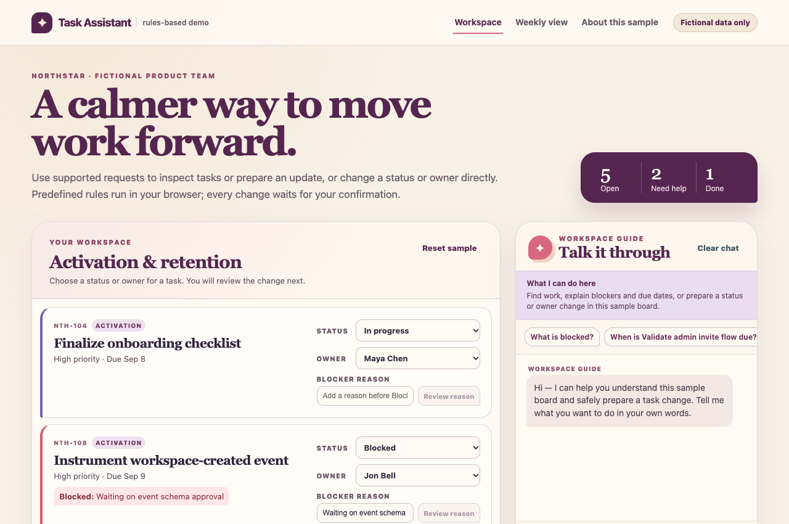

# Task Assistant — rules-based Product Management case study

Inspect fictional tasks and review changes to their status or owner. This demo follows predefined browser rules; it has no AI model or Asana connection. All records in this demo are fictional.

**Try it:** Ask “What is blocked?”, then prepare a task update and cancel its preview before trying confirmation. [Open the demo](https://mvahedi2020.github.io/Asana-Agent/) · [Follow the walkthrough](docs/product/Sample%20Walkthrough.md).

**Reviewer route:** [Decision brief](docs/product/Case_Study.md) → [sample walkthrough](docs/product/Sample%20Walkthrough.md) → [PRD and acceptance examples](docs/product/PRD.md) → [measures and validation](docs/product/Measures.md) → [product decisions](docs/product/Product_Decisions.md). You can also [see the assistant evaluation approach](docs/product/AI_Evaluation.md) or [try the live sample](https://mvahedi2020.github.io/Asana-Agent/).

Task Assistant uses predefined rules entirely in your browser. It has no AI model, server backend, or Asana connection. It is an independent product sample for a calmer way to understand and update work. A fictional product lead can ask about tasks in everyday language, then review a clear before-and-after preview before a change is made. It is not affiliated with Asana.

Product tradeoff: review every proposed task change even when confirmation adds effort. The next investment depends on whether conversation improves routine coordination compared with the direct controls. See the [case study](docs/product/Case_Study.md) for the proposed comparison and investment criteria.

The `Asana-Agent` repository and URL are legacy addresses retained so existing links continue to work. The current product name is **Task Assistant**.

## What you can try

The sample understands these requests without requiring a task code:

- “What is blocked?”
- “When is Validate admin invite flow due?”
- “Mark Finalize onboarding checklist as done.”
- “Assign Review trial nurture copy to Jon Bell.”
- “Complete all tasks in review.”

It also understands common status words such as **done**, **in progress**, and **reopen**, and first names such as “Maya” when assigning work. After a clear task is discussed, a follow-up such as “mark that done” works too. If more than one task could match, the guide asks which one you mean. It can explain due dates, but due-date changes are outside this sample. It never applies a change before you confirm it.

The task cards also have direct Status and Owner menus. These do not change data immediately: they open the same review step as the conversation. Confirm, cancel, reset, bulk changes, and undo are all previewed. Confirmed sample changes persist in the browser and the latest one can be undone.

## What this is and is not

Northstar, its people, dates, tasks, and results are fictional. The assistant uses a small local sample dataset and deterministic request handling. There is no login, Asana connection, API, paid service, external AI call, customer data, research result, or production claim. Browser storage is local to the device and may be unavailable; the sample makes this visible and offers a reviewed reset.

## My role as Product Manager

I defined the problem framing, target user, prioritization, scope, task workflows, fictional sample content, safety rules, acceptance criteria, and evaluation plan. The central product decision is deliberate: conversation may propose a change, but the person must see the affected task and before-and-after values before it is applied. I excluded live integrations and open-ended AI to keep that promise testable in the sample. This represents Product Manager ownership of the product work; I did not manually author the application code.

AI tools assisted with implementation and verification. This portfolio prototype should be reviewed as a product sample, not as proof that I owned production software or produced business impact.

## Review the product work

- [Case study](docs/product/Case_Study.md)
- [Public sample walkthrough](docs/product/Sample%20Walkthrough.md)
- [Product requirements](docs/product/PRD.md)
- [Control matrix](docs/product/Control_Matrix.md)
- [Validation plan](docs/product/Validation.md)
- [Assistant evaluation approach](docs/product/AI_Evaluation.md)
- [Proposed measures and guardrails](docs/product/Measures.md)
- [GTM strategy](docs/product/GTM_Strategy.md)
- [Sprint backlog](docs/product/Sprint_Backlog.md)
- [Contributing and local setup](CONTRIBUTING.md)

Licensed under the [MIT License](LICENSE).

## Read the product documents

[Open the formatted document index](https://mvahedi2020.github.io/Asana-Agent/docs/index.html) for the case study, walkthrough, requirements, and supporting product work. Markdown files remain the source documents.
